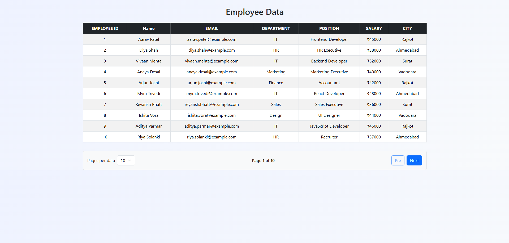
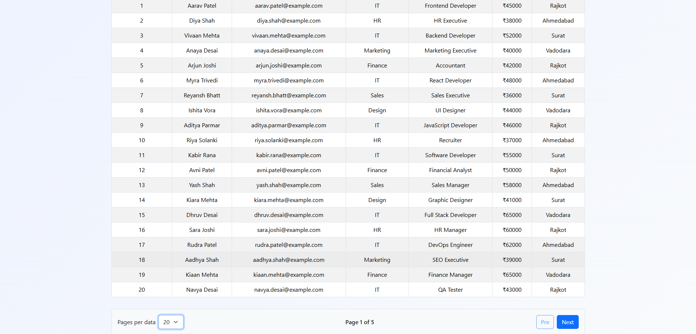
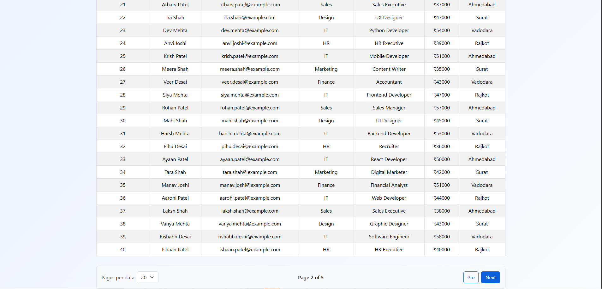
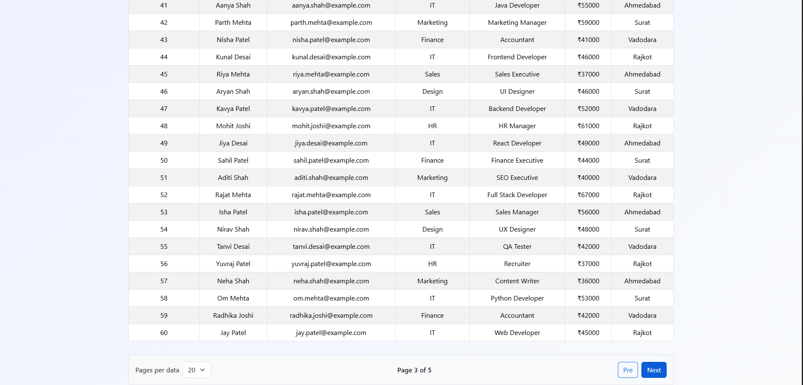
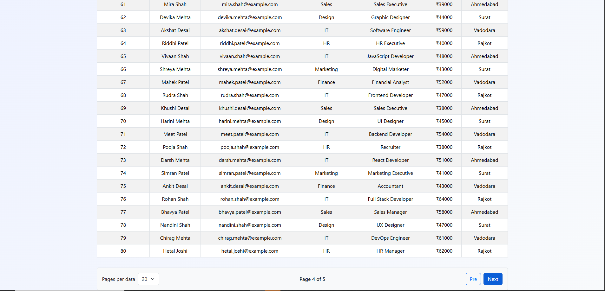
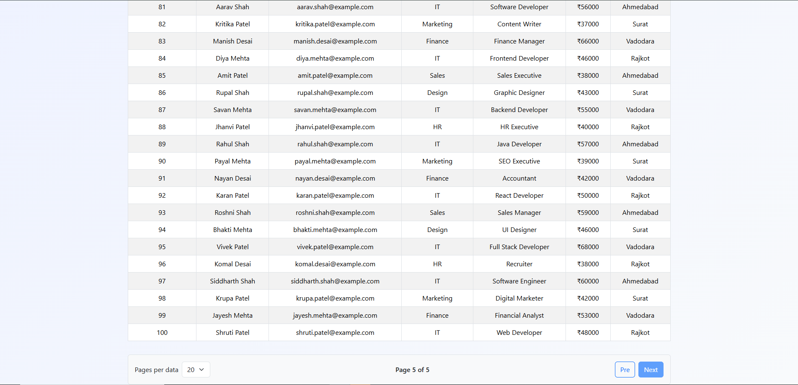

# 👨‍💻 EMPLOYEE DATA

A simple and responsive Employee Management System built using React.js, Bootstrap, and JSON Server.The project fetches employee data from a JSON Server API and displays it in a clean Bootstrap table with pagination.

## 🚀 Features
- 👥 Display 100 employee records
- 📡 Fetch employee data using fetch()
- 🗄️ JSON Server API integration
- 📊 Responsive Bootstrap table
- 🆔 Employee ID display
- 📧 Email information
- 🏢 Department and position details
- 💰 Salary information
- 📍 Employee city
- 📄 Pagination functionality
- 🔢 Select rows per page
- ⬅️ Previous page button
- ➡️ Next page button
- 📱 Responsive design
- 🎨 Clean and modern UI

## 🛠️ Technologies Used

- ⚛️ React.js

- 🟨 JavaScript

- 🎨 Bootstrap

- 🌐 JSON Server

- 📝 HTML

🎨 CSS

👨‍💼 Employee Data

- Each employee contains:

- 🆔 Employee ID
- 👤 Name
- 📧 Email
- 🏢 Department
- 💼 Position
- 💰 Salary
- 📍 City

## 📄 Pagination

- The project supports different numbers of employees per page:

- 10 Employees
- 20 Employees
- 30 Employees
- 40 Employees
- 50 Employees

- The total number of pages is calculated dynamically according to the selected rows per page.

## 📁 Project Structure

- 📁 JSON-DATA-table

 - 📂 public

 - 📂 src

   - 📄 App.jsx

   - 🎨 App.css

   - 📄 main.jsx
   
📄 db.json

📄 package.json

📄 README.md

## 📸 Imges

## 📸 Video

https://drive.google.com/file/d/1eoAuypJ6lUcmbtMn2IYydAPd8ubJqv4n/view?usp=sharing